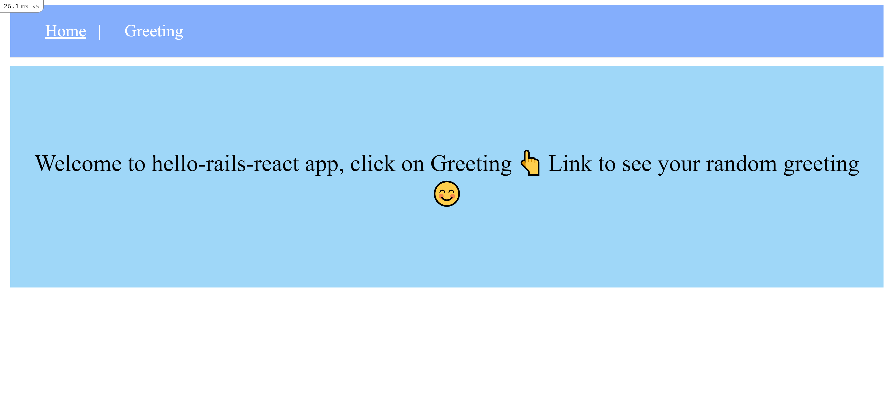

# hello-rails-react

## Table of Contents

- [About the Project](#about-the-project)
- [Built With](#built-with)
- [Getting Started](#getting-started)
- [Prerequisites](#prerequisites)
- [Contributing](#contributing)
- [Author](#author)
- [Acknowledgements](#acknowledgements)

## About Project

This is practice project on working with the `react-rails` gem. This gem allows you to build React components as a part of your Rails JavaScript and serve it in a component, `react_component`, to be used in a regular ERB file.



## Built With

- Ruby v2.7.2
- Rails 6.1.2
- Postgresql
- Bootstap
- SCSS
- Javascript

## Getting Started

- Clone this repo https://github.com/Lameck1/hello-rails-react

  ```bash
  git clone https://github.com/Lameck1/hello-rails-react.git
  ```

- Navigate to hello-rails-react folder/directory

  ```bash
  cd hello-rails-react
  ```

- On the terminal, while in the 'hello-rails-react' directory, run the following to install dependencies:

  ```bash
  bundle install
  ```

  ```bash
  rails webpacker:install:react
  ```

- At this point, you still don't have the PostgreSQL database. Run the following to get setup:

  - Ensure that postgresql service is up and runnning

    ```bash
    sudo service postgresql start
    ```

  - Create the database

    ```bash
    rails db:create
    ```

  - Migrate the database

    ```
    rails db:migrate
    ```

  - Run `rails db:seed` to quickly get setup with sample data for testing the app.

- To interact with the project, run:

  ```
  rails server
  ```

  OR

  ```
  rails s
  ```

- Go to the browser and enter
  `http://localhost:3000`

### Prerequisites

- Ensure you have these installed:

  - Git
  - Ruby 3.0.2
  - Ruby on rails `gem install rails`

- You also need to ensure your yarn is upto date
  ```
  yarn install --check-files
  ```

## Contributing

Contributions, issues, and feature requests are welcome!

Feel free to check the [issues page](https://github.com/Lameck1/hello-rails-react/issues).

## Author

👤 **Lameck Otieno**

- GitHub: [@githubhandle](https://github.com/Lameck1)
- Twitter: [@twitterhandle](https://twitter.com/lameck721)
- LinkedIn: [LinkedIn](https://www.linkedin.com/in/lameck-odhiambo-642b7077/)

## Acknowledgements

Credits go to the following for providing guides on Ruby on Rails

- [**Rails Guides**](https://guides.rubyonrails.org)

## Show your support

Give a ⭐️ if you like this project!
